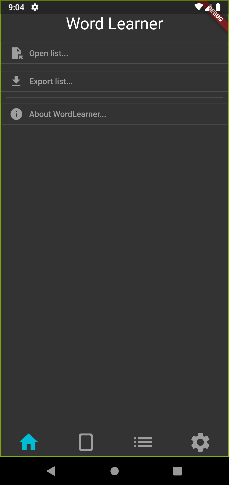
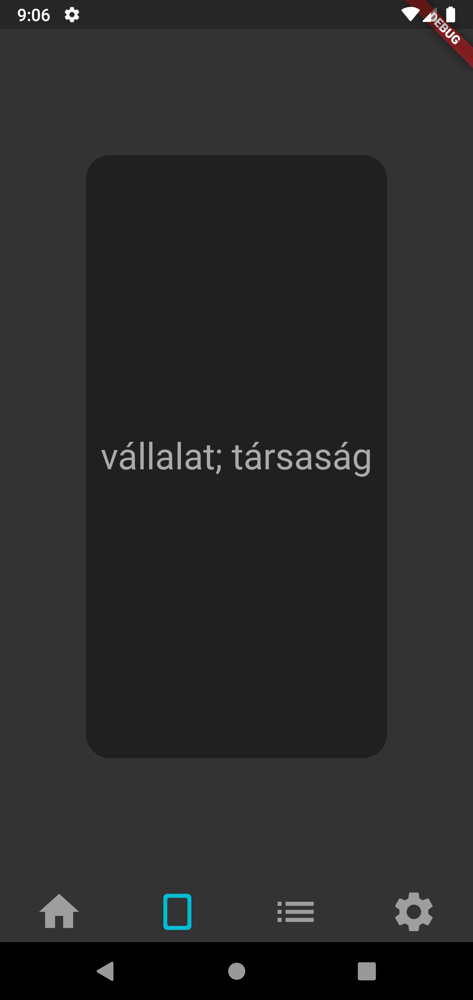
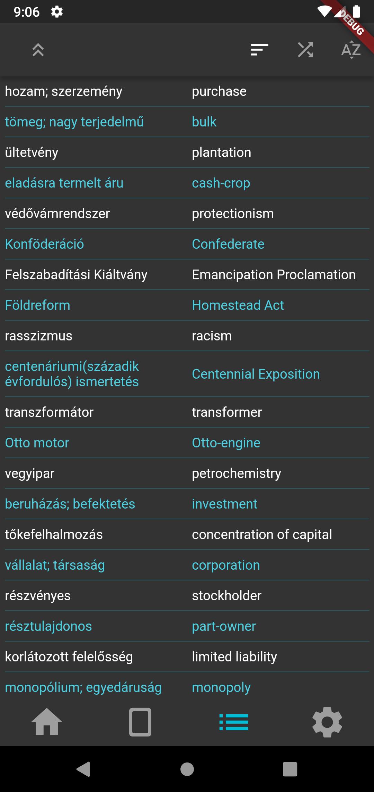
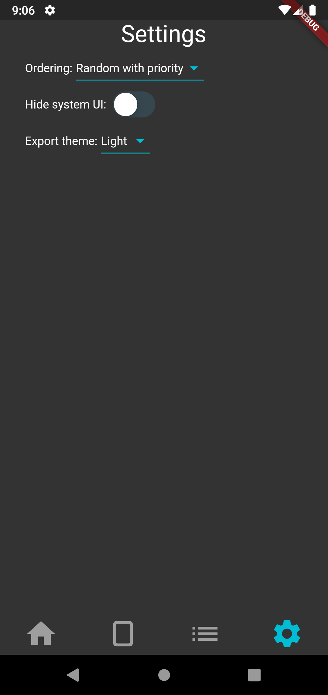

# word_learner

A flashcard app that can help you memorize words or other information.

## Screenshots

## Building

1. Clone the repository and enter the directory
2. Run `flutter build apk`
3. The resulting APK will be at `build/app/outputs/flutter-apk/app-release.apk`